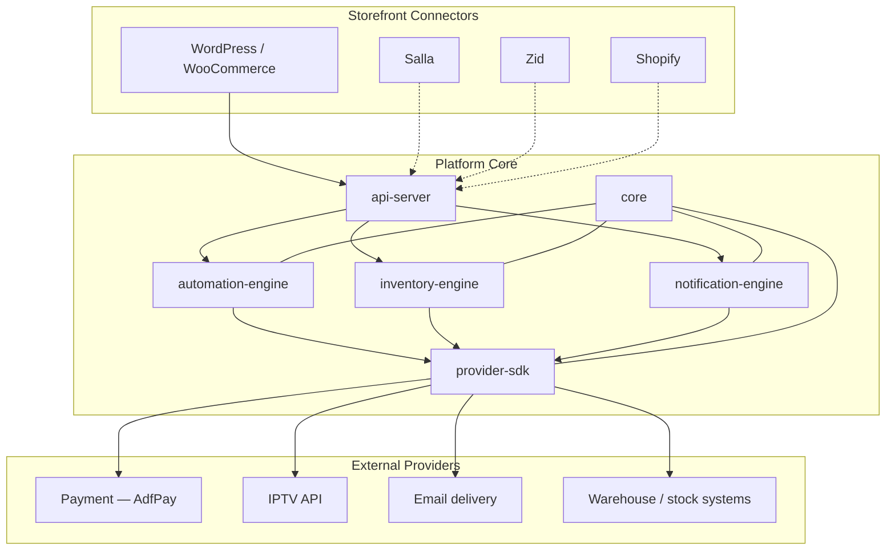

# Architecture

High-level system design for the Digital Automation Platform.

## System context



**Solid lines:** Sprint 0 scope. **Dashed lines:** Planned connectors.

## Layer model

| Layer      | Location                                                                | Responsibility                                               |
| ---------- | ----------------------------------------------------------------------- | ------------------------------------------------------------ |
| Connectors | `apps/wordpress-plugin`, future connector apps                          | Capture storefront events, relay config, authenticate to API |
| API        | `apps/api-server`                                                       | Auth, routing, webhooks, admin operations                    |
| Engines    | `packages/automation-engine`, `inventory-engine`, `notification-engine` | Domain execution                                             |
| SDK        | `packages/provider-sdk`                                                 | Vendor-specific API clients and adapters                     |
| Core       | `packages/core`                                                         | Shared models, events, config, errors                        |

**Rule:** Connectors and apps never implement fulfillment logic. They translate channel-specific payloads into platform events.

## Platform independence from WordPress

The platform core has **no WordPress runtime dependency**. WooCommerce appears only in the WordPress connector, which:

- Subscribes to WooCommerce hooks (order paid, refunded, etc.)
- Maps orders to canonical platform events
- Calls `api-server` over HTTPS

All automation rules, provider calls, and notification templates are defined and executed in the platform. WordPress can be replaced by another connector without rewriting engines.

## Delivery models

The platform supports two fulfillment strategies, selectable per product or automation action:

### API-based delivery

Digital goods provisioned by calling an external API at fulfillment time (e.g. IPTV subscription creation). Characteristics:

- Real-time provisioning on trigger
- Idempotent requests with external reference IDs
- Response mapped to customer-facing payload (credentials, activation link)

### Inventory-based delivery

Digital goods drawn from a pre-loaded stock pool (license keys, voucher codes, account slots). Characteristics:

- Stock reserved at checkout, committed on payment
- Allocation from `inventory-engine` with depletion tracking
- Suitable when no live provisioning API exists or for bulk pre-purchased inventory

Both models flow through `automation-engine` actions and are auditable in a single execution log.

## Event flow (Lord TV reference)

```
WooCommerce order paid
  → WordPress connector POST /events/order.paid
  → automation-engine: match rule "Lord TV subscription"
  → provider-sdk: AdfPay verify (if required)
  → provider-sdk: IPTV API create subscription
  → notification-engine: email credentials to customer
  → connector webhook / API: optional order note update
```

## Data ownership

| Data                                | System of record                               |
| ----------------------------------- | ---------------------------------------------- |
| Product catalog, cart, checkout     | Storefront (WooCommerce, etc.)                 |
| Automation definitions, run history | Platform                                       |
| Pre-loaded codes / license pool     | Platform (`inventory-engine`)                  |
| Provisioned subscription state      | Provider (IPTV API) + platform audit copy      |
| Payment state                       | Payment provider (AdfPay) + platform event log |

## Security boundaries

- Connectors authenticate with scoped API keys per merchant/site
- Provider credentials stored server-side only; never in WordPress options as plain text
- Webhook signatures verified at `api-server` ingress
- Admin dashboard uses separate operator auth from connector keys

## Deployment topology (target)

- **api-server** — Stateless, horizontally scalable
- **Workers** — Queue consumers for automation steps and notifications
- **PostgreSQL** — Platform state, runs, inventory pool
- **Redis** — Queues, locks, idempotency keys
- **Connectors** — Deployed on merchant infrastructure (WordPress plugin) or as lightweight relay services

See [ROADMAP.md](ROADMAP.md) for implementation phasing and [DECISIONS.md](DECISIONS.md) for recorded architectural choices.
