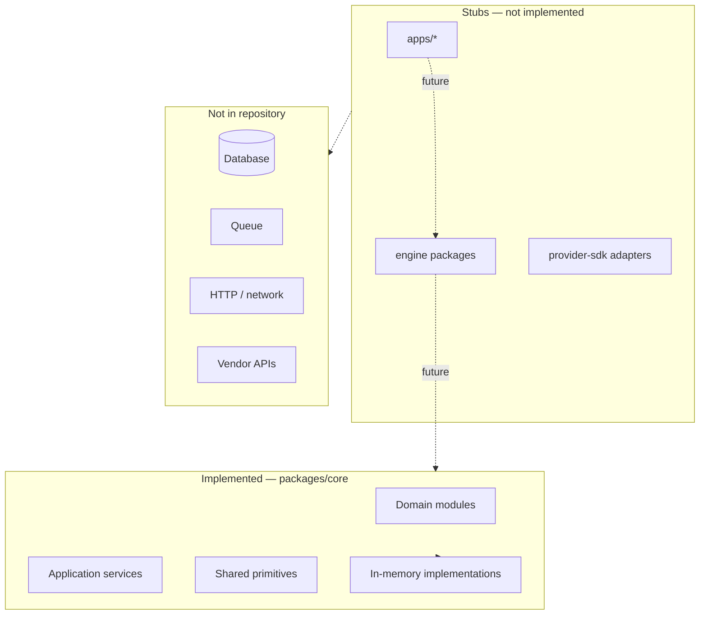
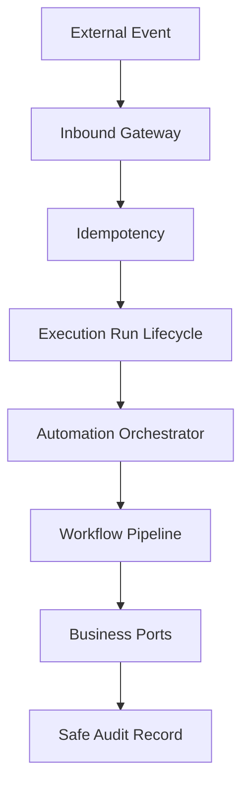
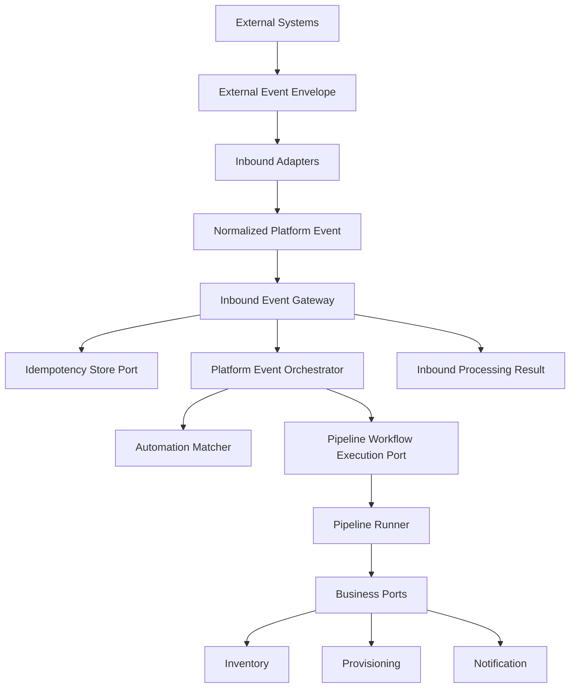
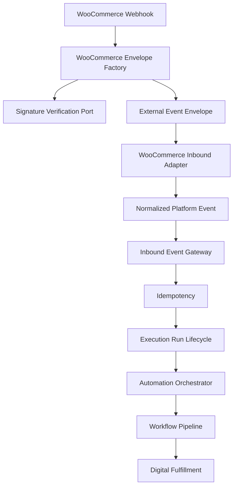
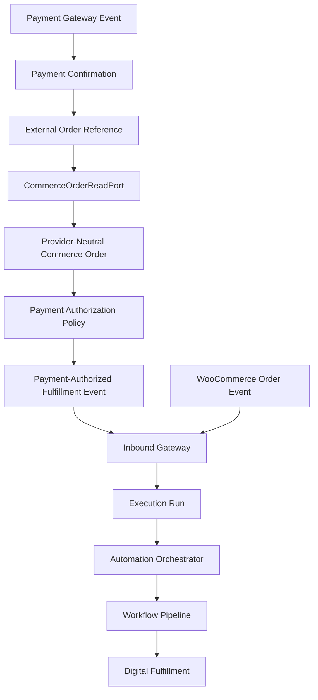
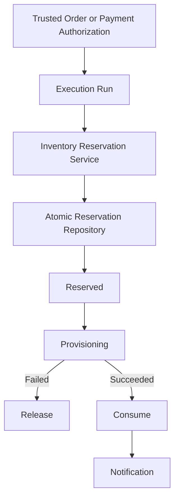
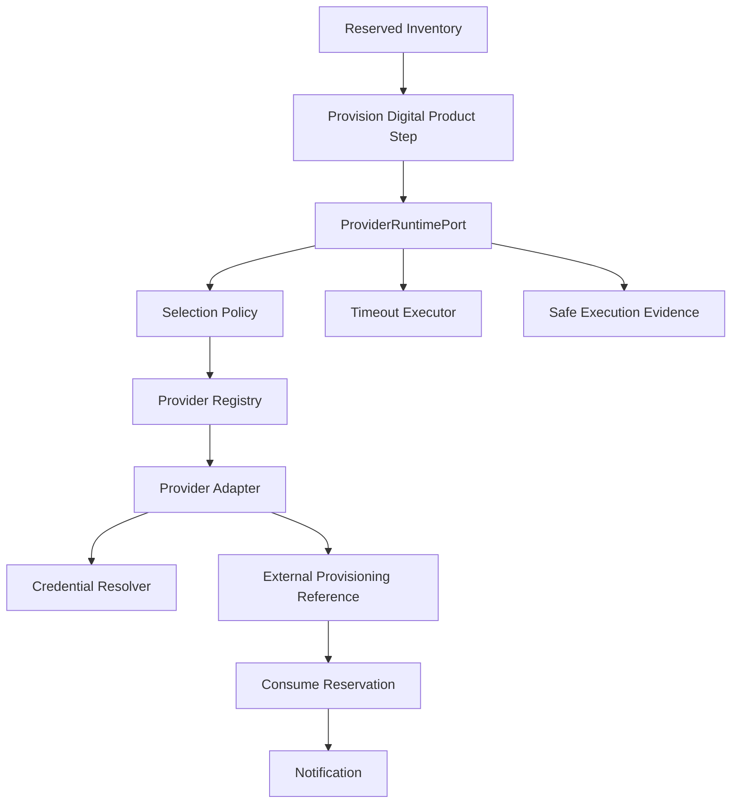
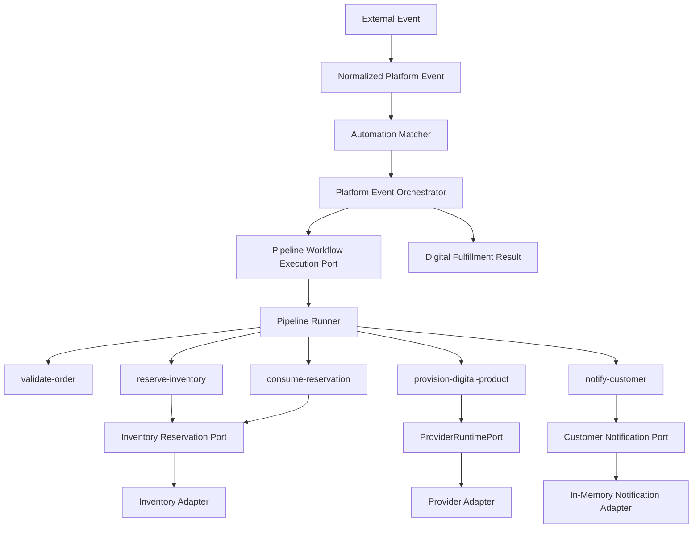

# Architecture Baseline

Architecture snapshot of the Digital Automation Platform **as implemented after Sprint 19**.  
**Owner:** Osama AL-Sharif  
**Status:** Current baseline (Sprint 19)

This document describes what exists in the repository today. For target-state design, see [ARCHITECTURE.md](ARCHITECTURE.md).

---

## Purpose

The platform automates digital commerce fulfillment — reserving inventory, invoking providers, running automation pipelines, and processing orders — independently of any single storefront or vendor SDK.

After Sprint 19, implemented business logic resides primarily in `@dap/core`, `@dap/payment`, and `@dap/provider-runtime` as provider-independent, in-memory TypeScript. The digital fulfillment vertical slice is proven through `DigitalFulfillmentService`, the inbound gateway, execution-run lifecycle, payment confirmation with authorization gating, an explicit **inventory reservation lifecycle** (reserve → provision → consume / release), and a **provider runtime** layer between the provisioning workflow step and vendor adapters. Inbound integration is modeled through `InboundEventGateway` with adapter ports and in-memory idempotency. Execution-run lifecycle and safe audit records are tracked through `ExecutionRunCoordinator` without persistence infrastructure. The first real commerce connector (`@dap/woocommerce-connector`) maps WooCommerce order webhooks into provider-neutral envelopes and normalized events. `@dap/adfpay-connector` maps AdfPay-shaped events into provider-neutral payment confirmations. Apps and engine packages are structural placeholders awaiting Phase 3 integrations. Production HTTP ingress, official AdfPay verification, durable inventory persistence, real vendor provisioning adapters, provider reconciliation, distributed concurrency control, and expiration workers remain deferred.

---

## Current system boundaries



**Inside boundary (implemented):** Domain models, application orchestration, in-memory event bus, in-memory inventory repository, workflow runtime, unit tests.

**Outside boundary (not implemented):** HTTP servers, WordPress plugin runtime, database, queues, authentication, vendor HTTP clients, production deployment.

---

## Execution run lifecycle (Sprint 15)



Execution runs correlate source, external event ID, normalized event ID, matched automations, workflows, ordered step progress, and safe terminal outcomes. Persistence and dashboards are deferred.

---

## Inbound event gateway (Sprint 14)



Vendor-specific adapters implement `InboundEventAdapter` outside core gateway logic. HTTP ingress and real webhook endpoints are deferred.

---

## WooCommerce inbound adapter (Sprint 16)



WooCommerce-specific code lives in `@dap/woocommerce-connector`. Real HTTP ingestion, WordPress plugin relay, and production WooCommerce connectivity are not complete.

---

## Payment confirmation and authorization (Sprint 17)



Strategy C (ADR-016): WooCommerce paid events and confirmed external payments may both authorize fulfillment, but `OrderFulfillmentAuthorizationPort` ensures the same external order reference cannot be fulfilled twice across paths.

**Not complete (deferred):**

- production AdfPay connection
- production webhook endpoint
- official AdfPay field mapping
- production secret management
- settlement reconciliation
- refunds / chargebacks / compensation
- persistent database
- real provider provisioning
- real notification delivery

---

## Inventory reservation lifecycle (Sprint 18)



`InventoryReservationService` owns provider-neutral reservation policy. `ExecutionRunReference` is the reservation owner. Workflow pipeline: validate → reserve → provision → consume → notify.

**Not complete (deferred):**

- durable SQL persistence for inventory pools and reservations
- distributed concurrency control / compare-and-set
- real scheduler and expiration worker
- automated reconciliation after partial-processing
- compensation engine
- physical warehouse / multi-location inventory
- production monitoring

---

## Provider runtime and provisioning execution (Sprint 19)



`@dap/provider-runtime` owns descriptor-based registry, deterministic single-provider selection, timeout-wrapped execution, and safe result projection. The workflow provisioning step calls `ProviderRuntimePort.executeProvisioning()` — not vendor adapters or registry internals directly.

**Key semantics (Sprint 19):**

- One selection, one adapter invocation per call — no retry, no failover
- Timeout does **not** prove remote non-execution — classify as `retry-after-reconciliation`
- Health on descriptors is **configured**, not live-monitored
- Registry and credentials are **in-memory only**
- Fake adapter idempotency in tests is **not universal** for production adapters
- Provisioning failure still triggers reservation release in the workflow step (Sprint 18 policy)

**Not complete (deferred):**

- durable provider registry and credential vault
- live health monitoring
- provider reconciliation and fulfillment recovery (Sprint 20 recommendation)
- real IPTV / vendor HTTP adapters
- automatic retry or failover policies

---

## Digital fulfillment vertical slice (Sprint 13)



---

## Domain modules

All paths relative to `packages/core/src/domain/`.

| Module                   | Key types                                                                        | Responsibility                   |
| ------------------------ | -------------------------------------------------------------------------------- | -------------------------------- |
| `entities/`              | `Entity`, `AggregateRoot`                                                        | Base entity patterns             |
| `value-objects/`         | `ValueObject`                                                                    | Immutable value object base      |
| `events/`                | `DomainEvent`, `EventName`, `EventHandler`                                       | Event contracts                  |
| `repositories/`          | `IRepository`                                                                    | Repository marker interface      |
| `services/`              | `IDomainService`                                                                 | Domain service marker            |
| `automation/`            | `AutomationPipeline`, `AutomationStep`, `AutomationContext`, `AutomationResult`  | Pipeline execution model         |
| `automation-definition/` | `AutomationDefinition`, `RuleEvaluator`, `NormalizedPlatformEvent`               | Event-triggered rule definitions |
| `orchestration/`         | `WorkflowExecutionRequest`, `WorkflowExecutionOutcome`, orchestration result     | Event-to-workflow orchestration  |
| `inbound-event/`         | `ExternalEventEnvelope`, `IdempotencyKey`, `IdempotencyStore`, processing result | Inbound integration and dedup    |
| `execution-run/`         | `ExecutionRun`, `ExecutionRunAuditRecord`, `ExecutionRunRepository`              | Run lifecycle and audit trail    |
| `workflow-pipeline/`     | `WorkflowDefinition`, `PipelineStepDefinition`, pipeline results                 | Declarative workflow pipelines   |
| `fulfillment/`           | `DigitalFulfillmentRequest`, `DigitalFulfillmentResult`, provisioning delivery   | Digital fulfillment contracts    |
| `notification/`          | `CustomerNotificationRequest`, `CustomerNotificationResult`                      | Notification contracts           |
| `provisioning/`          | `DigitalProductProvisioningRequest`, `DigitalProductProvisioningResult`          | Provisioning contracts           |
| `inventory/`             | `InventoryItem`, `InventoryRepository`, domain events                            | Inventory lifecycle              |
| `provider/`              | `Provider`, `ProviderRegistry`, `ProviderFactory`, capabilities                  | Provider abstraction             |
| `order/`                 | `Order`, `OrderItem`, `ExecutionPlan`, processing events                         | Order fulfillment model          |
| `workflow/`              | `WorkflowExecution`, `WorkflowPlan`, metrics, history                            | Workflow runtime model           |

---

## Application modules

All paths relative to `packages/core/src/application/`.

| Module                               | Key services                                                                         | Responsibility                    |
| ------------------------------------ | ------------------------------------------------------------------------------------ | --------------------------------- |
| `events/`                            | `EventBus`, `InMemoryEventBus`                                                       | Event dispatch                    |
| `commands/`, `queries/`, `handlers/` | CQRS marker interfaces                                                               | Command/query pattern             |
| `automation/`                        | `AutomationExecutor`, command handler                                                | Pipeline execution + events       |
| `automation-definition/`             | `AutomationMatcher`                                                                  | Rule matching orchestration       |
| `orchestration/`                     | `PlatformEventOrchestrator`, `PipelineWorkflowExecutionPort`                         | Event-to-workflow orchestration   |
| `inbound-event/`                     | `InboundEventGateway`, `FakeInboundEventAdapter`, composition root                   | Inbound integration boundary      |
| `execution-run/`                     | `ExecutionRunCoordinator`, audit mapper, lifecycle/progress ports                    | Execution run lifecycle recording |
| `workflow-pipeline/`                 | `PipelineRunner`, fulfillment step executors                                         | Workflow pipeline execution       |
| `fulfillment/`                       | `DigitalFulfillmentService`, ports, fake adapters, composition root                  | Digital fulfillment use case      |
| `inventory/`                         | `InventoryService`                                                                   | Inventory lifecycle orchestration |
| `order/`                             | `OrderProcessingService`, `OrderValidator`, `ExecutionPlanBuilder`, `OrderProcessor` | Order fulfillment orchestration   |
| `workflow/`                          | `WorkflowRuntime`, step executor registry, execution plan adapter                    | Workflow execution orchestration  |

---

## Shared modules

`packages/core/src/shared/` — cross-cutting primitives with no upward dependencies:

- `errors/` — `BaseError`, `DomainError`, `ApplicationError`
- `types/` — `Identifier`, `Result`, utility types
- `utils/` — `Guard`

---

## Dependency rules

These rules govern all current and future code:

1. **Apps may depend on packages.** Apps compose engines and core; they expose HTTP, UI, or connector surfaces.
2. **Packages must never depend on apps.**
3. **Domain code must not depend on application or infrastructure code.** Domain imports only shared and other domain modules.
4. **Application code may depend on domain abstractions** and shared modules.
5. **Infrastructure implementations will depend on domain/application contracts** — not the reverse.
6. **External vendor details must not leak into core domain models.** Use provider capabilities and injected adapters.
7. **WordPress-specific types must stay inside the connector** (`apps/wordpress-plugin`).
8. **Provider credentials must never be exposed to storefront connectors.** Credentials are server-side only.

### Layer dependency (within `@dap/core`)

```
shared  ←  domain  ←  application
```

Application services receive dependencies via constructor injection (repositories, event bus, registries, executors).

---

## Package ownership

| Package                      | Owns today                                                                     | Does not own                                    |
| ---------------------------- | ------------------------------------------------------------------------------ | ----------------------------------------------- |
| `@dap/core`                  | All domain models, application services, in-memory implementations, unit tests | HTTP, persistence, vendor SDKs                  |
| `@dap/provider-runtime`      | Provider registry, selection, timeout execution, safe evidence                 | Inventory, payment, notification, workflow      |
| `@dap/woocommerce-connector` | WooCommerce envelope, signature verification, inbound adapter                  | Authorization policy, fulfillment orchestration |
| `@dap/payment`               | Provider-neutral payment confirmation, authorization, correlation, repository  | Gateway parsing, HTTP, persistence              |
| `@dap/adfpay-connector`      | AdfPay adapter, parser, fake signature verifier                                | Authorization policy, fulfillment orchestration |
| `@dap/automation-engine`     | Nothing (stub)                                                                 | Domain models (future: composition only)        |
| `@dap/inventory-engine`      | Nothing (stub)                                                                 | Domain models (future: persistence adapters)    |
| `@dap/provider-sdk`          | Nothing (stub)                                                                 | Provider contracts (those live in core)         |
| `@dap/notification-engine`   | Nothing (stub)                                                                 | Notification domain (future)                    |
| `apps/*`                     | Nothing (stubs)                                                                | Business rules                                  |

See [PACKAGE_BOUNDARIES.md](PACKAGE_BOUNDARIES.md) for detailed per-package rules.

---

## In-memory implementations

| Concern                         | Implementation                                  | Location                         |
| ------------------------------- | ----------------------------------------------- | -------------------------------- |
| Event dispatch                  | `InMemoryEventBus`                              | `application/events/`            |
| Inventory storage               | `InMemoryInventoryRepository`                   | `domain/inventory/`              |
| Provider instances              | `ProviderRegistry` + injected factories         | `domain/provider/`               |
| Automation definitions          | `InMemoryAutomationDefinitionRepository`        | `domain/automation-definition/`  |
| Workflow execution (tests)      | `InMemoryWorkflowExecutionPort`                 | `application/orchestration/`     |
| Pipeline step executors (tests) | `InMemoryPipelineStepExecutorRegistry`          | `application/workflow-pipeline/` |
| Fulfillment adapters (tests)    | Fake provisioning, in-memory notification       | `application/fulfillment/`       |
| Idempotency store (tests)       | `InMemoryIdempotencyStore`                      | `domain/inbound-event/`          |
| Inbound adapter (tests)         | `FakeInboundEventAdapter`                       | `application/inbound-event/`     |
| Execution run store (tests)     | `InMemoryExecutionRunRepository`                | `domain/execution-run/`          |
| Payment records (tests)         | `InMemoryPaymentRepository`                     | `@dap/payment`                   |
| Order fulfillment authorization | `InMemoryOrderFulfillmentAuthorizationRegistry` | `@dap/payment`                   |
| Clock (tests)                   | `FakeClock`                                     | `shared/time/`                   |
| Workflow step handlers          | `InMemoryWorkflowStepExecutorRegistry`          | `application/workflow/`          |
| Workflow/order/automation state | Process memory only                             | Lost on restart                  |

All implementations are deterministic and suitable for unit testing without external services.

---

## Known missing infrastructure

| Capability             | Target phase                                     | Notes                             |
| ---------------------- | ------------------------------------------------ | --------------------------------- |
| PostgreSQL persistence | Phase 4                                          | Runs, inventory pools, audit      |
| Queue / Redis          | Phase 4                                          | Async step execution, retries     |
| HTTP API server        | Phase 3                                          | Event ingestion                   |
| Authentication         | Phase 5                                          | API keys, operator auth           |
| Idempotency store      | Phase 2 (in-memory contracts), Phase 4 (durable) | Gateway-level dedup in memory     |
| Workflow persistence   | Phase 4 (durable runs)                           | Execution run contracts in memory |
| Vendor adapters        | Phase 3                                          | AdfPay, IPTV, email               |
| Observability          | Phase 8                                          | Logs, metrics, traces             |

---

## Current technical debt

| Item                                         | Impact                                         | Planned resolution                                     |
| -------------------------------------------- | ---------------------------------------------- | ------------------------------------------------------ |
| All logic in `@dap/core`                     | Engine packages are empty stubs                | Phase 2 — compose via engine packages per ADR-008      |
| Order processor executes plans directly      | Workflow runtime not yet wired into order flow | Phase 2 — connect order processing to workflow runtime |
| No durable idempotency                       | In-memory only; lost on restart                | Phase 4 persistence                                    |
| Gateway idempotency only                     | Per-source/event; not per-automation yet       | ADR-010 orchestration-level dedup in future sprint     |
| In-memory-only state                         | No durability across restarts                  | Phase 4                                                |
| `packages/core/README.md` outdated           | Says Sprint 2 only                             | Sprint 9 docs (optional follow-up)                     |
| Vision ADR numbering vs sprint ADR numbering | Two ADR sequences in docs                      | Consolidate index in DECISIONS.md                      |

---

## Rules for future development

1. **Add domain models to `@dap/core` first.** Engine packages compose; they do not redefine equivalent types.
2. **Keep domain free of I/O.** No `fetch`, database drivers, or filesystem access in domain or application layers of core.
3. **Inject dependencies.** Services accept interfaces, not concrete infrastructure.
4. **Publish domain events** for lifecycle transitions already established (inventory, automation, order, workflow).
5. **Write unit tests** alongside new modules; maintain green `pnpm test`.
6. **Record significant decisions** as ADRs in `docs/decisions/`.
7. **Do not reverse dependency direction.** See diagram in [PACKAGE_BOUNDARIES.md](PACKAGE_BOUNDARIES.md).

---

## Related documents

- [ARCHITECTURE.md](ARCHITECTURE.md) — Target system design
- [PACKAGE_BOUNDARIES.md](PACKAGE_BOUNDARIES.md) — Package responsibilities
- [ROADMAP.md](ROADMAP.md) — Phased delivery
- [decisions/ADR-008-core-and-engine-boundaries.md](decisions/ADR-008-core-and-engine-boundaries.md) — Core vs engine decision
