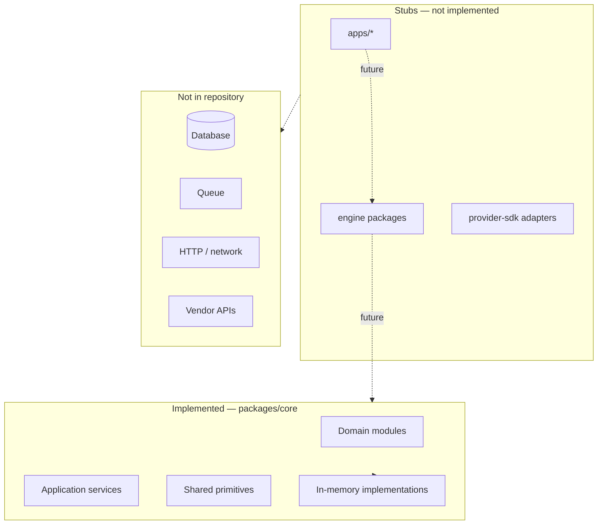

# Architecture Baseline

Architecture snapshot of the Digital Automation Platform **as implemented after Sprint 10**.  
**Owner:** Osama AL-Sharif  
**Status:** Current baseline (Sprint 10)

This document describes what exists in the repository today. For target-state design, see [ARCHITECTURE.md](ARCHITECTURE.md).

---

## Purpose

The platform automates digital commerce fulfillment — reserving inventory, invoking providers, running automation pipelines, and processing orders — independently of any single storefront or vendor SDK.

After Sprint 10, all implemented logic resides in `@dap/core` as provider-independent, in-memory TypeScript. Apps and engine packages are structural placeholders awaiting further Phase 2+ work.

---

## Current system boundaries



**Inside boundary (implemented):** Domain models, application orchestration, in-memory event bus, in-memory inventory repository, workflow runtime, unit tests.

**Outside boundary (not implemented):** HTTP servers, WordPress plugin runtime, database, queues, authentication, vendor HTTP clients, production deployment.

---

## Domain modules

All paths relative to `packages/core/src/domain/`.

| Module                   | Key types                                                                       | Responsibility                   |
| ------------------------ | ------------------------------------------------------------------------------- | -------------------------------- |
| `entities/`              | `Entity`, `AggregateRoot`                                                       | Base entity patterns             |
| `value-objects/`         | `ValueObject`                                                                   | Immutable value object base      |
| `events/`                | `DomainEvent`, `EventName`, `EventHandler`                                      | Event contracts                  |
| `repositories/`          | `IRepository`                                                                   | Repository marker interface      |
| `services/`              | `IDomainService`                                                                | Domain service marker            |
| `automation/`            | `AutomationPipeline`, `AutomationStep`, `AutomationContext`, `AutomationResult` | Pipeline execution model         |
| `automation-definition/` | `AutomationDefinition`, `RuleEvaluator`, `NormalizedPlatformEvent`              | Event-triggered rule definitions |
| `inventory/`             | `InventoryItem`, `InventoryRepository`, domain events                           | Inventory lifecycle              |
| `provider/`              | `Provider`, `ProviderRegistry`, `ProviderFactory`, capabilities                 | Provider abstraction             |
| `order/`                 | `Order`, `OrderItem`, `ExecutionPlan`, processing events                        | Order fulfillment model          |
| `workflow/`              | `WorkflowExecution`, `WorkflowPlan`, metrics, history                           | Workflow runtime model           |

---

## Application modules

All paths relative to `packages/core/src/application/`.

| Module                               | Key services                                                                         | Responsibility                    |
| ------------------------------------ | ------------------------------------------------------------------------------------ | --------------------------------- |
| `events/`                            | `EventBus`, `InMemoryEventBus`                                                       | Event dispatch                    |
| `commands/`, `queries/`, `handlers/` | CQRS marker interfaces                                                               | Command/query pattern             |
| `automation/`                        | `AutomationExecutor`, command handler                                                | Pipeline execution + events       |
| `automation-definition/`             | `AutomationMatcher`                                                                  | Rule matching orchestration       |
| `inventory/`                         | `InventoryService`                                                                   | Inventory lifecycle orchestration |
| `order/`                             | `OrderProcessingService`, `OrderValidator`, `ExecutionPlanBuilder`, `OrderProcessor` | Order fulfillment orchestration   |
| `workflow/`                          | `WorkflowRuntime`, step executor registry, execution plan adapter                    | Workflow execution orchestration  |

---

## Shared modules

`packages/core/src/shared/` — cross-cutting primitives with no upward dependencies:

- `errors/` — `BaseError`, `DomainError`, `ApplicationError`
- `types/` — `Identifier`, `Result`, utility types
- `utils/` — `Guard`

---

## Dependency rules

These rules govern all current and future code:

1. **Apps may depend on packages.** Apps compose engines and core; they expose HTTP, UI, or connector surfaces.
2. **Packages must never depend on apps.**
3. **Domain code must not depend on application or infrastructure code.** Domain imports only shared and other domain modules.
4. **Application code may depend on domain abstractions** and shared modules.
5. **Infrastructure implementations will depend on domain/application contracts** — not the reverse.
6. **External vendor details must not leak into core domain models.** Use provider capabilities and injected adapters.
7. **WordPress-specific types must stay inside the connector** (`apps/wordpress-plugin`).
8. **Provider credentials must never be exposed to storefront connectors.** Credentials are server-side only.

### Layer dependency (within `@dap/core`)

```
shared  ←  domain  ←  application
```

Application services receive dependencies via constructor injection (repositories, event bus, registries, executors).

---

## Package ownership

| Package                    | Owns today                                                                     | Does not own                                 |
| -------------------------- | ------------------------------------------------------------------------------ | -------------------------------------------- |
| `@dap/core`                | All domain models, application services, in-memory implementations, unit tests | HTTP, persistence, vendor SDKs               |
| `@dap/automation-engine`   | Nothing (stub)                                                                 | Domain models (future: composition only)     |
| `@dap/inventory-engine`    | Nothing (stub)                                                                 | Domain models (future: persistence adapters) |
| `@dap/provider-sdk`        | Nothing (stub)                                                                 | Provider contracts (those live in core)      |
| `@dap/notification-engine` | Nothing (stub)                                                                 | Notification domain (future)                 |
| `apps/*`                   | Nothing (stubs)                                                                | Business rules                               |

See [PACKAGE_BOUNDARIES.md](PACKAGE_BOUNDARIES.md) for detailed per-package rules.

---

## In-memory implementations

| Concern                         | Implementation                          | Location                |
| ------------------------------- | --------------------------------------- | ----------------------- |
| Event dispatch                  | `InMemoryEventBus`                      | `application/events/`   |
| Inventory storage               | `InMemoryInventoryRepository`           | `domain/inventory/`     |
| Provider instances              | `ProviderRegistry` + injected factories | `domain/provider/`      |
| Workflow step handlers          | `InMemoryWorkflowStepExecutorRegistry`  | `application/workflow/` |
| Workflow/order/automation state | Process memory only                     | Lost on restart         |

All implementations are deterministic and suitable for unit testing without external services.

---

## Known missing infrastructure

| Capability             | Target phase                                  | Notes                         |
| ---------------------- | --------------------------------------------- | ----------------------------- |
| PostgreSQL persistence | Phase 4                                       | Runs, inventory pools, audit  |
| Queue / Redis          | Phase 4                                       | Async step execution, retries |
| HTTP API server        | Phase 3                                       | Event ingestion               |
| Authentication         | Phase 5                                       | API keys, operator auth       |
| Idempotency store      | Phase 2 (contracts), Phase 4 (implementation) | Dedup order events            |
| Workflow persistence   | Phase 2 (contracts), Phase 4 (implementation) | Durable runs                  |
| Vendor adapters        | Phase 3                                       | AdfPay, IPTV, email           |
| Observability          | Phase 8                                       | Logs, metrics, traces         |

---

## Current technical debt

| Item                                         | Impact                                         | Planned resolution                                     |
| -------------------------------------------- | ---------------------------------------------- | ------------------------------------------------------ |
| All logic in `@dap/core`                     | Engine packages are empty stubs                | Phase 2 — compose via engine packages per ADR-008      |
| Order processor executes plans directly      | Workflow runtime not yet wired into order flow | Phase 2 — connect order processing to workflow runtime |
| No idempotency                               | Duplicate events could double-fulfill          | Phase 2 contracts, Phase 4 implementation              |
| In-memory-only state                         | No durability across restarts                  | Phase 4                                                |
| `packages/core/README.md` outdated           | Says Sprint 2 only                             | Sprint 9 docs (optional follow-up)                     |
| Vision ADR numbering vs sprint ADR numbering | Two ADR sequences in docs                      | Consolidate index in DECISIONS.md                      |

---

## Rules for future development

1. **Add domain models to `@dap/core` first.** Engine packages compose; they do not redefine equivalent types.
2. **Keep domain free of I/O.** No `fetch`, database drivers, or filesystem access in domain or application layers of core.
3. **Inject dependencies.** Services accept interfaces, not concrete infrastructure.
4. **Publish domain events** for lifecycle transitions already established (inventory, automation, order, workflow).
5. **Write unit tests** alongside new modules; maintain green `pnpm test`.
6. **Record significant decisions** as ADRs in `docs/decisions/`.
7. **Do not reverse dependency direction.** See diagram in [PACKAGE_BOUNDARIES.md](PACKAGE_BOUNDARIES.md).

---

## Related documents

- [ARCHITECTURE.md](ARCHITECTURE.md) — Target system design
- [PACKAGE_BOUNDARIES.md](PACKAGE_BOUNDARIES.md) — Package responsibilities
- [ROADMAP.md](ROADMAP.md) — Phased delivery
- [decisions/ADR-008-core-and-engine-boundaries.md](decisions/ADR-008-core-and-engine-boundaries.md) — Core vs engine decision
