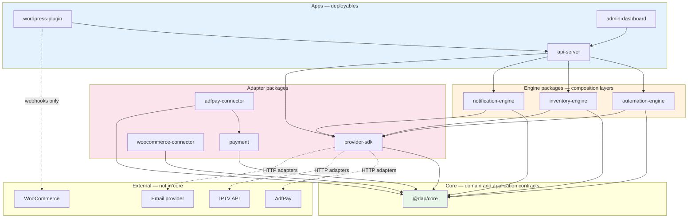

# Package Boundaries

Package ownership, dependency direction, and current status for the Digital Automation Platform.  
**Owner:** Osama AL-Sharif  
**Last updated:** Sprint 17

---

## Dependency diagram

**Rules illustrated:**

- Dependency flows **downward** — apps → engines → core.
- `provider-sdk` implements vendor adapters against **core provider contracts**.
- Core never imports from apps, engines, or vendor SDKs.
- Storefront connectors (WordPress) talk to `api-server`, not directly to providers.

---

## Global dependency rules

| Rule                     | Description                                                                |
| ------------------------ | -------------------------------------------------------------------------- |
| Apps → packages          | Apps compose packages; packages never import apps                          |
| Engines → core           | Engine packages depend on core contracts                                   |
| Domain isolation         | Domain code has no application or infrastructure imports                   |
| No vendor leakage        | Vendor field names and credentials stay in adapters and server config      |
| No connector credentials | Storefront connectors never receive provider secrets                       |
| No duplicate domain      | Engine packages compose core types; they do not redefine equivalent models |

---

## packages/core

**Owns**

- Provider-independent domain models, value objects, aggregates, and domain events
- Application service contracts and in-memory orchestration (automation, inventory, order, workflow)
- CQRS command/query/handler marker interfaces
- Shared errors, Result type, Identifier branding, Guard utilities
- In-memory event bus, in-memory inventory repository, provider registry
- Unit tests for all implemented modules

**May depend on**

- Internal modules within `@dap/core` only (shared ← domain ← application)
- Node.js built-ins where needed (e.g. `node:timers/promises` for retry delays)

**Must not depend on**

- Any `apps/*` package
- Any engine package (`automation-engine`, `inventory-engine`, etc.)
- HTTP clients, ORMs, queue libraries, or vendor SDKs
- WordPress, WooCommerce, or storefront-specific types

**Current status:** **Implemented** — all business logic through Sprint 15 lives here, including inbound gateway, idempotency, and execution-run lifecycle contracts. WooCommerce-specific inbound code lives in `@dap/woocommerce-connector`.

**Planned responsibility:** Remain the canonical home for domain and application **contracts**. Infrastructure adapters will implement core repository and provider interfaces in future phases without moving domain models out of core.

---

## packages/automation-engine

**Owns (planned)**

- Automation definition storage and loading
- Rule matching and trigger evaluation
- Composition of `AutomationExecutor` with configured pipelines
- Public package entry point for automation operations
- Runtime wiring between events, rules, and actions

**May depend on (planned)**

- `@dap/core`
- `@dap/provider-sdk` (for provider-backed actions)

**Must not depend on**

- Any `apps/*` package
- WordPress or storefront SDKs
- Database drivers directly in domain-equivalent code (use injected repositories)

**Current status:** **Stub** — workspace package with placeholder export; automation logic is in `@dap/core`.

**Planned responsibility:** Infrastructure-aware orchestration layer that composes core automation modules. Does not redefine `AutomationPipeline`, `AutomationStep`, or `AutomationExecutor`.

---

## packages/inventory-engine

**Owns (planned)**

- Persistent inventory repository implementations
- Pool import and reconciliation jobs
- Composition of `InventoryService` with durable storage
- Public package entry point for inventory operations

**May depend on (planned)**

- `@dap/core`
- `@dap/provider-sdk` (optional — e.g. WMS sync)

**Must not depend on**

- Any `apps/*` package
- Storefront connectors

**Current status:** **Stub** — inventory domain and in-memory repository live in `@dap/core`.

**Planned responsibility:** Persistence and operational tooling around core inventory contracts. Does not redefine `InventoryItem` or reservation rules.

---

## packages/provider-sdk

**Owns (planned)**

- Vendor-specific HTTP/SDK adapters (AdfPay, IPTV, email, future WMS)
- Adapter registration with core `ProviderFactory` implementations
- Transport, authentication, and response mapping to core `ProviderRequest` / `ProviderResponse`
- Mock/stub providers for integration tests

**May depend on (planned)**

- `@dap/core` (provider contracts only)
- Vendor HTTP libraries (in adapter layer only)

**Must not depend on**

- Any `apps/*` package
- WordPress or WooCommerce libraries
- Domain models outside core provider contracts

**Current status:** **Stub** — provider **contracts** (`Provider`, `ProviderRegistry`, capabilities) live in `@dap/core`.

**Planned responsibility:** Implement `Provider` and `ProviderFactory` for each vendor. Re-export or register adapters; never duplicate capability definitions.

---

## packages/woocommerce-connector

**Owns**

- WooCommerce webhook envelope factory and signature verification
- WooCommerce order payload parser and validation
- `WooCommerceInboundEventAdapter` implementing `@dap/core` `InboundEventAdapter`
- WooCommerce-specific error types and test fixtures
- Test-focused composition root wiring WooCommerce adapter to inbound gateway stack

**May depend on**

- `@dap/core` (provider-neutral ports and contracts only)
- Node.js built-ins (`node:crypto` for HMAC verification)

**Must not depend on**

- Any `apps/*` package
- HTTP frameworks, ORMs, queue libraries
- WordPress/WooCommerce npm SDKs (payload arrives as validated JSON)
- `@dap/provider-sdk`

**Must not expose into core**

- WooCommerce field names, order REST shapes, or webhook header names in domain/application contracts

**Current status:** **Implemented** — Sprint 16 first real commerce inbound adapter. See [ADR-015](decisions/ADR-015-woocommerce-inbound-adapter.md).

**Planned responsibility:** Remain the canonical home for WooCommerce inbound mapping. HTTP ingress in `apps/api-server` composes this package; WordPress plugin relays signed payloads only.

---

## packages/payment

**Owns**

- Provider-neutral payment domain models (`PaymentConfirmation`, `PaymentStatus`, `Money`)
- `PaymentRepository` port and in-memory implementation
- Payment correlation and authorization policy
- `PaymentProcessingService` and payment fulfillment composition root
- In-memory order fulfillment authorization registry implementing core port

**May depend on**

- `@dap/core`

**Must not depend on**

- `@dap/adfpay-connector`
- `@dap/woocommerce-connector`
- Any `apps/*` package
- HTTP frameworks or database implementations

**Current status:** **Implemented** — Sprint 17 payment confirmation and authorization.

---

## packages/adfpay-connector

**Owns**

- AdfPay payload parser and fake authenticity verification boundary
- `AdfPayPaymentGatewayAdapter` implementing `PaymentGatewayAdapter`
- Test fixtures and integration tests

**May depend on**

- `@dap/payment`
- `@dap/core`

**Must not depend on**

- Fulfillment orchestration beyond provider-neutral payment ports
- Database or HTTP hosting

**Current status:** **Implemented** — Sprint 17 first payment gateway adapter (fake verification; production deferred).

---

## packages/notification-engine

**Owns (planned)**

- Email, SMS, and webhook delivery implementations
- Template rendering and delivery logs
- Composition layer invoked by automation actions

**May depend on (planned)**

- `@dap/core`
- `@dap/provider-sdk` (email/SMS provider adapters)

**Must not depend on**

- Any `apps/*` package
- Storefront connectors

**Current status:** **Stub** — no notification domain in core yet.

**Planned responsibility:** Outbound message delivery engine. Notification **contracts** may be added to core in Phase 2; delivery implementations stay here.

---

## apps/api-server

**Owns (planned)**

- HTTP routing, request validation, and API versioning
- Authentication and authorization for connectors and dashboard
- Event ingestion endpoints (`POST /events/*`)
- Webhook ingress from payment and fulfillment providers
- Composition of engine packages into request handlers

**May depend on (planned)**

- All engine packages and `@dap/core`

**Must not depend on**

- WordPress runtime
- Direct vendor SDK imports (route through `provider-sdk`)

**Current status:** **Stub** — README and package scaffold only.

**Planned responsibility:** Stateless HTTP entry point. No fulfillment business rules — delegates to engines and core services.

---

## apps/wordpress-plugin

**Owns (planned)**

- WooCommerce hook subscriptions (order paid, refunded, etc.)
- Mapping WooCommerce payloads to platform canonical events
- Authenticated HTTPS client to `api-server`
- Merchant settings UI (API URL, site key — not provider secrets)

**May depend on (planned)**

- WordPress/WooCommerce PHP APIs (connector layer only)
- `api-server` via HTTP

**Must not depend on**

- `@dap/core` npm package directly in PHP (communicates via API)
- Provider credentials or fulfillment logic
- IPTV, payment, or email SDKs

**Current status:** **Stub** — TypeScript workspace placeholder; real connector will be PHP in place on merchant WordPress.

**Planned responsibility:** Thin storefront connector. WordPress-specific types stay here.

---

## apps/admin-dashboard

**Owns (planned)**

- Operator authentication UI
- Run monitoring, failed run replay, provider connection management
- Read-only metrics and audit views

**May depend on (planned)**

- `api-server` via HTTP/API client

**Must not depend on**

- WordPress
- Direct engine package imports (uses API)
- Provider credentials in browser storage

**Current status:** **Stub** — workspace scaffold only.

**Planned responsibility:** Operator-facing UI. All mutations go through authenticated API calls.

---

## Core vs engine clarification

| Concern              | `@dap/core`                  | Engine packages               |
| -------------------- | ---------------------------- | ----------------------------- |
| Domain models        | Owns                         | Composes, never redefines     |
| Application services | Owns in-memory orchestration | Wires persistence and runtime |
| Provider contracts   | Owns interfaces              | Owns vendor adapters          |
| Persistence          | In-memory only               | Owns DB/queue implementations |
| Public API for apps  | Exports types and services   | Exports composed modules      |

See [decisions/ADR-008-core-and-engine-boundaries.md](decisions/ADR-008-core-and-engine-boundaries.md).

---

## Related documents

- [ARCHITECTURE_BASELINE.md](ARCHITECTURE_BASELINE.md)
- [ARCHITECTURE.md](ARCHITECTURE.md)
- [ROADMAP.md](ROADMAP.md)
